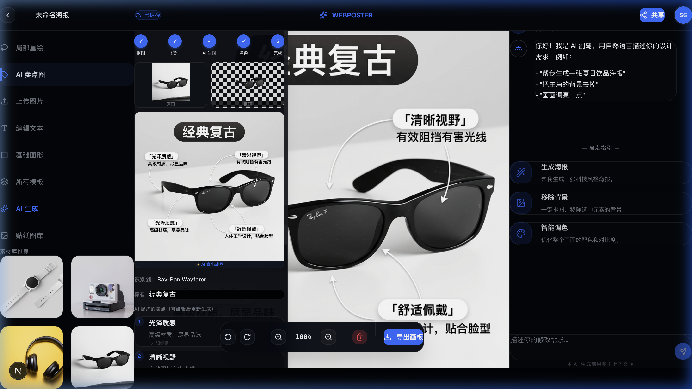

# AI 电商卖点图 — 全自动生成管线

> **WebPoster AI Visual Pipeline** — 从裸产品图到交付级卖点标注图的端到端自动化

---

## 1. 产品定位

一键上传产品裸图，AI 全自动完成 **抠图 → 品类识别 → 卖点提炼 → 成品出图**，零人工干预即可生成带有精准卖点标注的电商详情图。

### 核心价值

| 传统流程 | AI 管线 |
|---------|---------|
| 设计师手动抠图 (10min) | 浏览器端 ONNX 自动抠图 (30s) |
| 文案团队撰写卖点 (30min) | Gemini Vision 一次提炼 (5s) |
| 设计师排版合成 (60min) | Gemini 原生图像生成一步出图 (30s) |
| 总计 ~2h | 总计 ~65s |

---

## 2. 管线架构

```
用户上传裸图
     │
     ▼
┌──────────────┐
│  Step 1: 抠图  │  @imgly/background-removal (浏览器端 ONNX)
│  ~30s         │  输出: 透明 PNG 前景图
└──────┬───────┘
       │
       ▼
┌──────────────┐
│  Step 2: 分析  │  Gemini 2.0 Flash (Vision API)
│  ~5s          │  输出: 品类、部件、卖点文案、场景 Prompt
└──────┬───────┘
       │
       ▼
┌──────────────────────────────────────────────┐
│  Step 3: AI 一步出图                           │
│  Gemini 3.1 Flash Image (Nano Banana 2)      │
│  ~30-60s                                      │
│                                               │
│  输入: 产品抠图 + 卖点文案 + 排版指令 + 场景描述  │
│  输出: 完整成品图 (文字标注已 baked-in)          │
└──────┬───────────────────────────────────────┘
       │
       ▼
┌──────────────┐
│  Step 4: 渲染  │  Fabric.js Canvas
│  即时          │  将成品图渲染到画布，支持后续编辑
└──────┬───────┘
       │
       ▼
┌──────────────────────────────────────────────┐
│  Step 5: AI 洞察 Editable Actions             │
│  Gemini 2.5 Flash (Vision)                   │
│  ~3s                                          │
│                                               │
│  输入: 成品图 + 品类 + 卖点上下文              │
│  输出: 3-5 个针对性优化建议 (JSON)             │
│                                               │
│  每个建议包含:                                 │
│  · label: 按钮文字                             │
│  · reason: 为什么建议这样做（洞察）             │
│  · prompt: 执行时传给生图模型的 Prompt          │
└──────┬───────────────────────────────────────┘
       │
       ▼
  ✅ 完成 → 展示 AI 洞察的 Actions
```

### 关键设计决策：为什么是"AI 一步出图"而非"传统合成"

| | 传统合成路线 | AI 一步出图 |
|---|---|---|
| **流程** | 分步生成背景 → Fabric.js 叠加文字 → 算法定位 | 将全部信息写进 Prompt → AI 直出成品 |
| **排版质量** | 依赖 bbox 坐标算法，易导致重叠错乱 | AI 理解画面语义，自主排版 |
| **视觉一致性** | 文字与场景割裂感强 | 文字融入画面，风格统一 |
| **中文渲染** | Fabric.js 矢量字体完美 | 依赖模型能力，Nano Banana 2 已基本可用 |
| **灵活性** | 可逐元素编辑 | 整图重新生成 |

---

## 3. 技术实现

### 3.1 API Routes

#### `/api/analyze-product` — 品类识别与卖点提炼

```
POST /api/analyze-product
Body: { imageBase64: string }
Model: gemini-2.0-flash
```

**功能**：接收原始产品图，返回结构化 JSON：
- `product.name` — 产品名称（如 "Ray-Ban Wayfarer"）
- `product.category` — 品类（如 "eyewear"）
- `subParts[]` — 部件列表（id, description, bbox）
- `sellingPoints[]` — 卖点文案（headline, subtitle, targetId）
- `mainTitle` — 主标题
- `scenePrompt` — 推荐的场景描述

#### `/api/generate-final` — AI 一步出图（核心）

```
POST /api/generate-final
Body: {
  cutoutImage: string,     // 抠图后的产品 base64
  mainTitle: string,       // 主标题
  category: string,        // 品类
  sellingPoints: [{        // 卖点列表
    headline: string,
    subtitle: string
  }],
  sceneHint?: string       // 可选场景提示
}
Model: gemini-3.1-flash-image-preview (Nano Banana 2)
```

**Prompt 策略**：将产品图、场景描述、标题、卖点文案、排版规则全部编码进一个 Prompt，让模型在一次 `generateContent` 调用中生成包含所有元素的成品图。

**关键参数**：
```json
{
  "generationConfig": {
    "responseModalities": ["TEXT", "IMAGE"]
  }
}
```

> ⚠️ 必须同时请求 TEXT 和 IMAGE，否则 API 返回空白。

### 3.2 核心组件

| 文件 | 职责 |
|------|------|
| `stores/featureCalloutStore.ts` | Zustand 状态机，管理管线 4 阶段 (idle → removing_bg → analyzing → generating_scene → compositing → done) |
| `components/feature-callout/FeatureCalloutPanel.tsx` | UI 面板：上传区、进度指示器、卖点编辑器、Action 建议 |
| `utils/calloutLayout.ts` | 备用排版引擎（Fallback，当 AI 出图失败时使用 Fabric.js 合成） |

### 3.3 依赖

| 包 | 用途 | 运行环境 |
|----|------|---------|
| `@imgly/background-removal` | ONNX 自动抠图 | 浏览器 |
| `fabric` | Canvas 画布渲染 | 浏览器 |
| `zustand` | 状态管理 | 浏览器 |
| `lucide-react` | 图标 | 浏览器 |
| Gemini API | Vision + Image Generation | 服务端 |

---

## 4. Prompt 工程

### 4.1 分析 Prompt（analyze-product）

指导 Gemini Vision 输出结构化 JSON，重点约束：
- 卖点必须精炼为"四字标题 + 短句补充"格式
- 每个卖点必须关联到具体的 subPart id
- scenePrompt 需符合电商摄影规范

### 4.2 生图 Prompt（generate-final）

```
Create a professional e-commerce product detail image with:

## Product & Scene
- 产品居中，占画面 40-50%
- 场景: {sceneDesc}

## Title
- 「{mainTitle}」居中顶部，黑底白字胶囊

## Selling Points
- 卖点交替分布在产品左右两侧
- 每个卖点用圆角胶囊框 + 引线指向产品

## Style
- 商业摄影风格
- 800x800 正方形
- Apple 产品发布级质感
```

### 4.3 文案精准修改与重新生成

这是已跑通的核心交互：**用户在侧栏编辑文案 → 点击重新生成 → AI 用新文案重新出图**。

#### 数据流

```
┌─────────────────────────────────────────────────────────┐
│  Zustand Store (featureCalloutStore.ts)                  │
│                                                         │
│  calloutData: {                                         │
│    mainTitle: "经典复古"  ← 用户可改为 "特立独行"         │
│    sellingPoints: [                                     │
│      { id: "sp1", headline: "光泽质感", subtitle: "..." }│
│      { id: "sp2", headline: "清晰视野", subtitle: "..." }│ ← 可改为 "测试一下"
│      { id: "sp3", headline: "舒适佩戴", subtitle: "..." }│ ← 可改为 "必须生效"
│    ]                                                    │
│  }                                                      │
│                                                         │
│  cutoutImage: "data:image/png;base64,..."  (不变)       │
└─────────────────────────┬───────────────────────────────┘
                          │
            用户点击「修改文案后重新 AI 生成」
                          │
                          ▼
              regenerate() 方法:
              读取 store 中最新的 calloutData
              → 发送给 /api/generate-final
              → Gemini 用新文案重新生图
              → 新图渲染到画布
```

#### 关键代码

**1. 侧栏的 inline 编辑绑定（Panel）：**

```tsx
// 标题编辑 — 直接修改 store 中的 mainTitle
<input
  value={calloutData.mainTitle}
  onChange={(e) => updateMainTitle(e.target.value)}
/>

// 每个卖点的 headline / subtitle 编辑
<input
  value={sp.headline}
  onChange={(e) => updateSellingPoint(sp.id, { headline: e.target.value })}
/>
<input
  value={sp.subtitle}
  onChange={(e) => updateSellingPoint(sp.id, { subtitle: e.target.value })}
/>
```

**2. Store 中的状态更新（纯内存，不调 API）：**

```typescript
updateSellingPoint: (id, changes) => {
  const { calloutData } = get();
  set({
    calloutData: {
      ...calloutData,
      sellingPoints: calloutData.sellingPoints.map((sp) =>
        sp.id === id ? { ...sp, ...changes } : sp
      ),
    },
  });
},

updateMainTitle: (title) => {
  set({ calloutData: { ...calloutData, mainTitle: title } });
},
```

**3. 重新生成（读最新状态 → 调 API → 出新图）：**

```typescript
regenerate: async () => {
  const { calloutData, cutoutImage } = get();   // ← 读到的是用户修改后的文案
  
  const finalRes = await fetch('/api/generate-final', {
    body: JSON.stringify({
      cutoutImage,                                // ← 产品抠图不变
      mainTitle: calloutData.mainTitle,           // ← 可能已改为 "特立独行"
      sellingPoints: calloutData.sellingPoints,   // ← 可能已改为 "测试一下"
    }),
  });
  
  // → Gemini 收到新文案 → 生成新图 → 文字精准出现在画面中
},
```

#### 验证效果

| 修改内容 | AI 出图结果 |
|---------|-----------|
| 标题 "经典复古" → **"特立独行"** | ✅ 画面顶部显示「特立独行」 |
| 卖点2 "清晰视野" → **"测试一下"** | ✅ 画面右侧显示「测试一下」 |
| 卖点3 "舒适佩戴" → **"必须生效"** | ✅ 画面下方显示「必须生效」 |

> **关键洞察**：文案修改是纯前端状态操作（Zustand immutable update），只有点击
> "重新生成"时才会调用 API。这保证了编辑过程零延迟、零成本，用户可以反复调整直到满意后再触发生图。

---

## 5. 用户交互流程

```
1. 点击左侧栏「AI 卖点图」
2. 上传产品裸图 (JPG/PNG)
3. 自动执行:
   ├── [进度条 1/6] 抠图中...
   ├── [进度条 2/6] 识别卖点中...
   ├── [进度条 3/6] AI 生成成品图中...
   ├── [进度条 4/6] 渲染到画布...
   ├── [进度条 5/6] AI 分析优化建议...
   └── [进度条 6/6] ✅ 完成
4. 查看成品:
   ├── 画布: AI 直出的带标注图
   ├── 侧栏: 缩略图预览 + 卖点编辑器
   └── 💡 AI 洞察面板 (针对此图的优化建议)
5. 可选操作:
   ├── 点击任意 AI 建议 → 自动携带 Prompt 重新生图
   ├── 修改卖点文案 → 点击「重新 AI 生成」
   └── 导出画板
```

---

## 6. Editable Actions（AI 驱动的优化建议）

### 6.1 设计理念

Editable Actions **不是功能菜单**，而是 **AI 视觉策略师的提案**。

每张图的 Actions 都是独一无二的——AI 根据当前成品图的实际内容、品类特征、
视觉缺陷进行针对性分析，输出"你应该怎么改、为什么这样改"的洞察建议。

```
传统工具:  "你可以换背景 / 加滤镜 / 改文字"    ← 写死的通用菜单
WebPoster: "镜片反光不够，看不出清晰视野卖点，  ← 针对这张图的洞察
            建议添加透光对比效果"
```

### 6.2 技术方案：单次 LLM 调用

```
成品图 + 品类 + 卖点上下文
              │
              ▼
    ┌─────────────────────┐
    │  Gemini 2.5 Flash    │
    │  (Vision, ~3s)       │
    │                     │
    │  "你是电商视觉策略师， │
    │   看看这张图还能      │
    │   怎么优化"          │
    └─────────┬───────────┘
              │
              ▼
    3-5 个 Actions (JSON)
    每个包含:
    · label:  用户看到的按钮文字
    · reason: 为什么建议这么做（洞察）
    · impact: 预估效果
    · prompt: 执行时传给生图模型的完整 Prompt
```

### 6.3 同一个模型，不同图片 → 完全不同的 Actions

**墨镜图：**
```json
[
  {
    "label": "添加佩戴效果图",
    "reason": "用户更信任真人上脸效果，同品类带模特图 CTR 高 30%",
    "impact": "转化率预估 +25%",
    "prompt": "Generate the same sunglasses being worn by a model..."
  },
  {
    "label": "换户外阳光场景",
    "reason": "当前棚拍感强，户外场景更能凸显防晒卖点",
    "impact": "场景匹配度提升",
    "prompt": "Regenerate with outdoor sunny beach background..."
  },
  {
    "label": "增加镜片透光对比",
    "reason": "清晰视野是核心卖点，但画面上体现不出来",
    "impact": "卖点感知力 +40%",
    "prompt": "Add a split-lens demonstration showing UV filtering..."
  }
]
```

**蛋糕图：**
```json
[
  {
    "label": "增强奶油流动感",
    "reason": "奶油纹理偏平，加高光和流动感能提升食欲",
    "impact": "食欲感 +35%",
    "prompt": "Enhance the cream texture with flowing highlights..."
  },
  {
    "label": "添加切开截面",
    "reason": "展示内部层次是烘焙品类转化最高的表现手法",
    "impact": "好奇心驱动点击",
    "prompt": "Show a cross-section cut revealing internal layers..."
  }
]
```

### 6.4 API 设计

```
POST /api/suggest-actions
Body: {
  finalImage: string,      // 成品图 base64
  category: string,        // 品类
  sellingPoints: [...],    // 卖点上下文
  mainTitle: string        // 标题
}
Model: gemini-2.5-flash

Response: {
  actions: [
    {
      id: string,
      label: string,          // "添加佩戴效果图"
      reason: string,         // "用户更信任真人上脸效果"
      impact: string,         // "转化率预估 +25%"
      prompt: string,         // 完整的重新生图 Prompt
      icon: string            // emoji
    }
  ]
}
```

### 6.5 与原方案的对比

| | 原方案（规则引擎+专家库） | 当前简化方案 |
|---|---|---|
| **步骤** | 语义打标→规则匹配→LLM 精选 (3步) | 直接问 LLM (1步) |
| **维护成本** | 需维护 10+ 行业 Prompt 模板库 | 零维护，1 个通用 Prompt |
| **洞察质量** | 精准但刚性 | 灵活，足够好 |
| **落地时间** | 数周 | 1 小时 |
| **扩展方式** | 往规则库加规则 | 往 Prompt 加 few-shot 案例 |

---

## 7. 环境配置

```bash
# .env.local
GEMINI_API_KEY=your_gemini_api_key_here
```

- 分析、二次定位: `gemini-2.0-flash` (文本 + Vision)
- 生图: `gemini-3.1-flash-image-preview` (Nano Banana 2, 支持原生图像生成)

**API 版本**: `v1beta`

---

## 8. 演进路线与方案回退 (Rollback Record)

**尝试方案**：两阶段混合管线 (Hybrid Pipeline - Route 3)
原计划通过 `gemini-3.1-flash-image-preview` 仅生成无文字底图，然后通过 `gemini-2.0-flash` (Vision) 定位产品零件并在前端用 Fabric.js 矢量绘制标签（以解决改文案必须重新生图的问题）。

**回退原因**：
1. **版式混乱问题无法彻底解决**：尽管加入了各种避让算法，但是前端生成的标签大小固定、颜色固定，往往和原图生成出的光影氛围严重割裂。
2. **生图一致性难以保障**：脱离了文本上下文后，单独只给产品配场景图会使得最终图变得极其单调，丧失了海报排版的张力和美感。
3. **最终决策**：回退至 **AI 一次性直出整图 (One-shot, Route 1)**。即使修改文字会导致排版和光影的随机刷新（每次都不一样），但是 AI 大模型作为“整体艺术指导”一次性画图的效果和氛围感要远超冷冰冰的代码组装方案。这是在“编辑便利性”与“绝佳视觉美感”之间的妥协，我们选择了后者。

## 8. 模型演进记录

| 时间 | 模型 | 效果 |
|------|------|------|
| v1 | `gemini-2.0-flash-exp` | ❌ 已下线 |
| v2 | `gemini-2.5-flash-image` (Nano Banana) | ⚠️ 中文渲染乱码严重 |
| v3 | `gemini-3.1-flash-image-preview` (Nano Banana 2) | ✅ 中文准确，排版专业 |

---

## 9. 生成效果



**效果分析**：
- ✅ 标题「经典复古」准确渲染
- ✅ 三个卖点「光泽质感」「清晰视野」「舒适佩戴」全部正确
- ✅ 引线精准指向镜框、镜片、镜腿
- ✅ 左右均匀分布、无重叠
- ✅ 补充说明文字清晰可读

---

## 10. 文件索引

```
webposter/
├── app/api/
│   ├── analyze-product/route.ts    # Step 2: Gemini Vision 品类识别
│   ├── generate-final/route.ts     # Step 3: Gemini 一步出图 (核心)
│   ├── suggest-actions/route.ts    # Step 5: AI 洞察 Editable Actions
│   └── generate-scene/route.ts     # 备用: 纯场景生成
├── stores/
│   └── featureCalloutStore.ts      # 管线状态机
├── components/feature-callout/
│   └── FeatureCalloutPanel.tsx     # UI 面板
├── utils/
│   └── calloutLayout.ts           # Fallback 排版引擎
├── types/
│   └── featureCallout.ts          # 类型定义
└── docs/
    ├── ai_feature_callout_pipeline.md  ← 本文档
    └── ai_visual_strategist.md         ← 产品哲学 (完整版设计)
```
